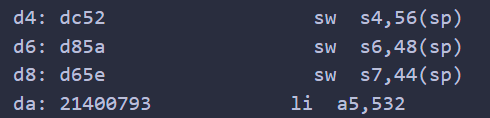
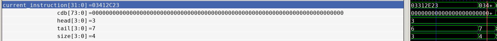
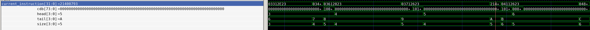
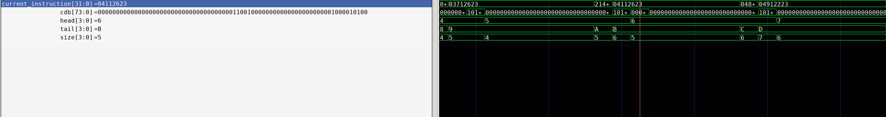
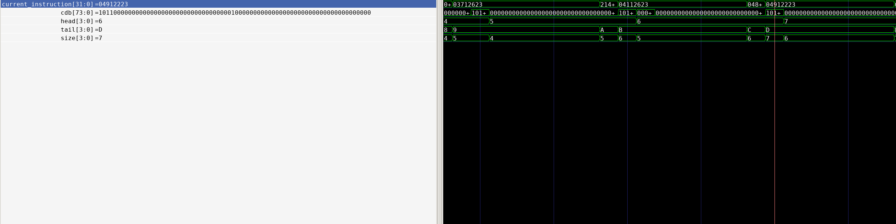

# 乱序执行

由于CDB广播了LSB以及ALU的指令执行情况，因此可以观察CDB来确定指令是否乱序。

对于array_test1这个程序来说，观察其汇编代码可以看到以下两条指令

d4和da两个地址的指令dc52与21400793，他们正常的执行顺序是先执行dc52后执行21400793。

在CPU中可以看到03412C23指令（即dc52指令的32位形式）先进入了rob队列，其下标为6（tail-1）。

之后21400793指令进入了队列，其下标为9。

监听CDB上的信号可以发现，之后依次出现了如下两个信号：

CDB的[35:32]与[72:69]分别代表load/store与alu指令对应rob中的下标，可以明显看到9号指令的结果在CDB上广播的时间早于6号指令广播时间因此可以看出乱序执行。
